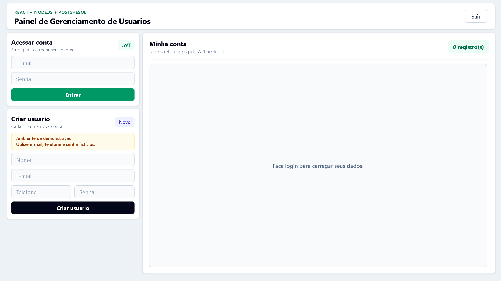
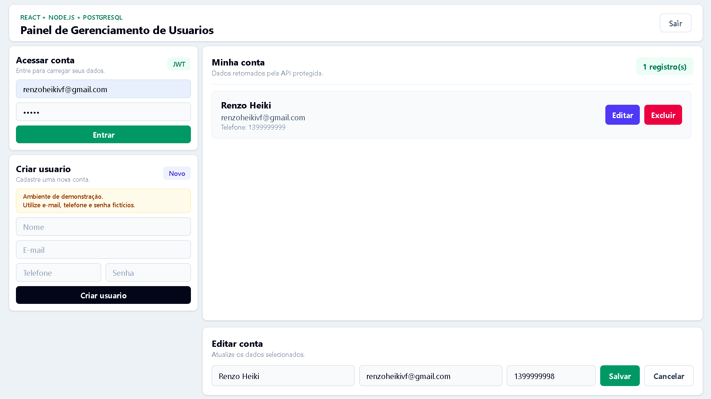

# CRUD Users Full Stack

Aplicação full stack para gerenciamento de usuários com autenticação JWT, API REST em Node.js, banco PostgreSQL e interface responsiva em React.

O projeto simula um fluxo real de cadastro, login, proteção de rotas e gerenciamento dos dados do usuário autenticado. A interface foi pensada para ser objetiva, limpa e adaptada para desktop e mobile.

O frontend também conta com feedback visual profissional usando toasts, estados de carregamento em botões e confirmação antes de ações destrutivas.


## Sobre o projeto

Este projeto foi desenvolvido para praticar e demonstrar conceitos importantes de desenvolvimento full stack:

- Criação de API REST com Node.js e Express
- Integração com banco de dados PostgreSQL
- Cadastro e login de usuários
- Criptografia de senhas com bcrypt
- Autenticação com JSON Web Token
- Middleware para rotas protegidas
- Controle de acesso por usuário autenticado
- Interface responsiva com React, Vite e Tailwind CSS
- Feedback visual com React Hot Toast
- Loading states em ações do usuário

## Funcionalidades

- Criar usuário
- Fazer login
- Gerar token JWT
- Listar os dados do usuário autenticado
- Buscar usuário por ID
- Atualizar nome, email e telefone
- Excluir usuário
- Confirmar exclusão antes de remover a conta
- Proteger rotas privadas no backend
- Validar dados antes de criar ou atualizar usuários
- Consumir a API pelo frontend com Axios
- Exibir mensagens de sucesso e erro com toasts
- Mostrar estados de carregamento nos botões de login, criação, edição e exclusão
- Tratar erros de API com mensagens amigáveis

## Tecnologias utilizadas

**Frontend**

- React
- Vite
- Tailwind CSS
- Axios
- React Hot Toast

**Backend**

- Node.js
- Express
- PostgreSQL
- JWT
- bcrypt
- dotenv
- CORS
- Nodemon

## Estrutura do projeto

```text
crud-users-fullstack/
|-- backend/
|   |-- src/
|   |   |-- config/
|   |   |   `-- database.js
|   |   |-- controllers/
|   |   |   `-- userController.js
|   |   |-- middlewares/
|   |   |   |-- authMiddleware.js
|   |   |   `-- validateUser.js
|   |   |-- routes/
|   |   |   `-- userRoutes.js
|   |   |-- app.js
|   |   `-- server.js
|   `-- package.json
|
|-- frontend/
|   |-- src/
|   |   |-- App.jsx
|   |   |-- main.jsx
|   |   `-- main.css
|   |-- index.html
|   |-- vite.config.js
|   `-- package.json
|
`-- README.md
```

## Endpoints da API

| Método | Rota | Descrição | Autenticação |
| --- | --- | --- | --- |
| GET | `/` | Verifica se a API está rodando | Não |
| POST | `/users` | Cria um novo usuário | Não |
| POST | `/login` | Autentica usuário e retorna JWT | Não |
| GET | `/users` | Lista os dados do usuário logado | Sim |
| GET | `/users/:id` | Busca usuário por ID | Sim |
| PUT | `/users/:id` | Atualiza usuário | Sim |
| DELETE | `/users/:id` | Exclui usuário | Sim |

As rotas privadas utilizam o header:

```http
Authorization: Bearer seu_token_jwt
```

## Como rodar localmente

### 1. Clone o repositório

```bash
git clone https://github.com/RenzoFernandes/crud-users-fullstack.git
cd crud-users-fullstack
```

### 2. Configure o backend

```bash
cd backend
npm install
```

Crie um arquivo `.env` dentro da pasta `backend`:

```env
PORT=3000
DB_USER=seu_usuario
DB_HOST=localhost
DB_NAME=seu_banco
DB_PASSWORD=sua_senha
DB_PORT=5432
JWT_SECRET=sua_chave_secreta
```

Execute o servidor:

```bash
npm run dev
```

A API ficará disponível em:

```text
http://localhost:3000
```

### 3. Configure o frontend

Em outro terminal:

```bash
cd frontend
npm install
npm run dev
```

O frontend ficará disponível em:

```text
http://localhost:5173
```

## Banco de dados

O projeto utiliza PostgreSQL. A tabela principal esperada pela aplicação é:

```sql
CREATE TABLE users (
  id SERIAL PRIMARY KEY,
  name VARCHAR(100) NOT NULL,
  email VARCHAR(150) UNIQUE NOT NULL,
  phone VARCHAR(30) NOT NULL,
  password VARCHAR(255) NOT NULL,
  created_at TIMESTAMP DEFAULT CURRENT_TIMESTAMP
);
```

## Interface

A interface foi desenvolvida em React com foco em simplicidade e usabilidade:

- Layout compacto para desktop
- Design responsivo para mobile
- Formulários de login, cadastro e edição
- Painel com dados do usuário autenticado
- Feedback visual com notificações toast
- Estados de carregamento nos botões durante requisições
- Confirmação antes da exclusão da conta
- Mensagens amigáveis para erros de autenticação, token e conexão

## Preview

### Login e Dashboard



### Edição de Usuário



## Deploy

### Frontend

Link da aplicação hospedada na Vercel:

```text
Adicione aqui o link público da Vercel
```

### Backend

Link da API hospedada no Render:

```text
https://crud-users-fullstack.onrender.com
```

### Banco de Dados

PostgreSQL hospedado no Neon.

> O backend está hospedado no plano gratuito do Render. A primeira requisição pode demorar alguns segundos caso o servidor esteja inativo.

## Hospedagem e Infraestrutura

- Frontend hospedado na Vercel
- Backend hospedado no Render
- Banco PostgreSQL hospedado no Neon
- Deploy contínuo integrado ao GitHub
- Atualizações automáticas via push na branch principal

## Aprendizados

Durante o desenvolvimento foram aplicados conceitos de:

- Separação entre frontend e backend
- Arquitetura MVC simplificada no backend
- Boas práticas em rotas protegidas
- Consumo de API REST no React
- Persistência de token no navegador
- Tratamento de erros em requisições HTTP
- Design responsivo com Tailwind CSS
- UX com feedback visual não bloqueante
- Controle de estados de carregamento por ação

## Status

Projeto finalizado em sua primeira versão (V1), contendo autenticação JWT, CRUD completo, integração full stack, deploy em cloud e interface responsiva.

## Autor

Desenvolvido por Renzo Heiki.

- GitHub: [RenzoFernandes](https://github.com/RenzoFernandes)
- LinkedIn: www.linkedin.com/in/renzo-fernandes
